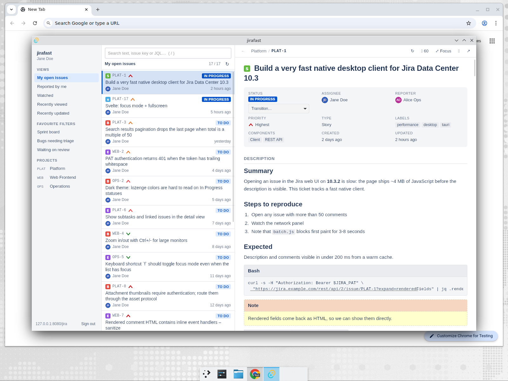
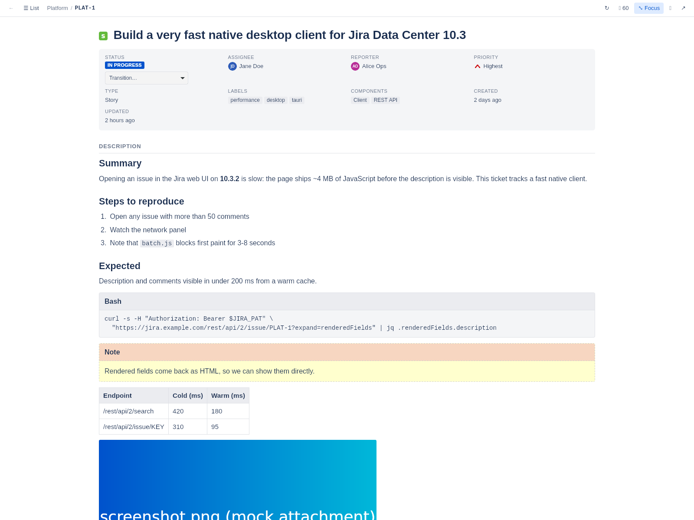
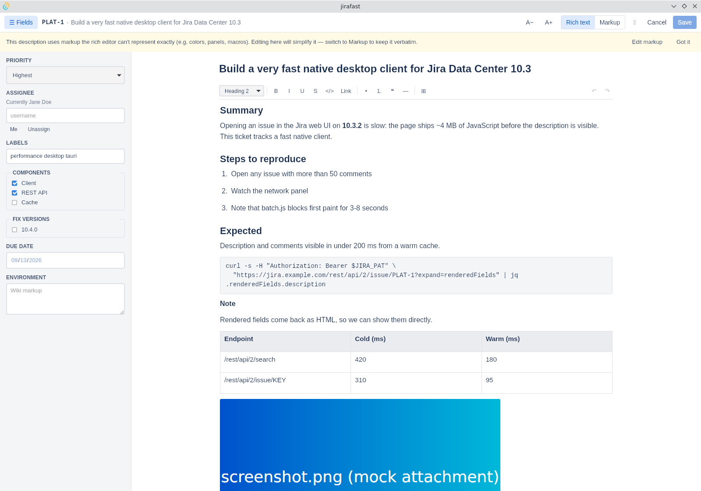

# jirafast

A very fast desktop client for **Jira Server / Data Center** (tested against the
10.3.x REST API), built with [Tauri v2](https://v2.tauri.app) (Rust), React 19 and
[TipTap](https://tiptap.dev).

It exists for one reason: reading and writing issues should be instant, and the
description and comments should get the whole screen.



## Why it is fast

- **No Jira web UI.** The Rust backend talks to `/rest/api/2` directly and the
  webview only renders what you are looking at. No multi-megabyte `batch.js`.
- **Server-rendered HTML, shown as-is.** Jira already renders wiki markup to
  HTML (`expand=renderedFields`); jirafast sanitizes it (no scripts/handlers)
  and displays it natively with Jira-like styling for panels, code blocks,
  tables, lozenges and mentions.
- **Two-level cache (memory + disk), stale-while-revalidate.** Lists and issues
  you have seen appear immediately from cache and refresh in the background.
- **Prefetching.** Neighbouring issues in the list are fetched while you read
  the current one, so `j`/`k` navigation is instant.
- **Authenticated asset protocol.** Attachments, thumbnails, avatars and icons
  are loaded through a custom `jira-asset://` scheme that adds your credentials
  and caches the bytes on disk.
- **One persistent HTTP/2 connection**, gzip, rustls; release builds use LTO.

## Big description / comments

- **Focus mode (`f`)** hides the sidebar and the issue list: the issue fills the
  window with a wide, readable column.
- **Fullscreen (`F11`)** on top of that takes the whole screen.
- **Ctrl +/−** zooms the text.
- Comments can be sorted oldest/newest first; `c` opens the comment box,
  `Ctrl+Enter` posts.



## Editing and creating issues

- **Edit (`e`)** opens a full-window zen editor: only the summary and the
  description. `☰ Fields` / `Ctrl+B` (`Ctrl+Shift+F` while typing in the
  rich editor) slides in a left sidebar with priority, assignee, labels,
  components, fix versions, due date and environment, driven by `editmeta`.
- **New issue (`n` or `＋`)** uses the same editor with project, issue type and
  parent (for sub-tasks) from `createmeta`.
- The description is edited as **rich text** (TipTap: headings, lists, links,
  code blocks, tables, quotes, images) and converted back to the Jira wiki
  markup that Jira Server stores. Markup the editor cannot represent (colors,
  panels, macros…) triggers a warning; `Ctrl+P` switches to editing the raw
  wiki markup verbatim. `Ctrl+S` saves; `Esc` cancels (asks before discarding
  changes).
- Images in descriptions, comments and attachments open in a fullscreen
  lightbox (click; zoom with `+`/`-`/`0`/`1`, `←`/`→` between images).



## Features

- Personal Access Token (recommended) or username/password auth, optional
  acceptance of self-signed certificates, Jira context paths (`https://host/jira`).
- Quick views (my open issues, reported by me, watched, recently viewed/updated),
  favourite filters and projects in the sidebar.
- Search box accepts plain text, an issue key, or JQL.
- Issue view: status + transitions, assignee (+ assign to me), reporter,
  priority, type, labels, components, fix versions, due date, description,
  environment, attachments, subtasks, linked issues, comments.
- Issue links inside descriptions/comments open in the app; other links open in
  your browser.
- Window size/position remembered between runs.

### Keyboard shortcuts

| Key | Action |
| --- | --- |
| `j` / `k`, `↓` / `↑` | next / previous issue |
| `f` | toggle focus mode |
| `e` | edit the issue |
| `n` | new issue |
| `F11` | toggle fullscreen |
| `/` | search |
| `c` | add a comment |
| `r` | refresh list and issue |
| `u` | back to previous issue |
| `b` | toggle sidebar |
| `Esc` | leave focus mode / blur input |
| `?` | shortcuts help |

## Install / build

Prerequisites: [Rust](https://rustup.rs), Node.js 20+, and the
[Tauri v2 system dependencies](https://v2.tauri.app/start/prerequisites/) for
your OS (on Debian/Ubuntu: `libwebkit2gtk-4.1-dev build-essential libssl-dev
libayatana-appindicator3-dev librsvg2-dev libxdo-dev`).

```bash
npm install
npm run tauri dev      # development, hot reload
npm run tauri build    # produces installers in src-tauri/target/release/bundle
```

Pre-built binaries for Linux, Windows and macOS are produced by the
[CI workflow](.github/workflows/build.yml) on every push to `main` and on tags.

## Connecting

1. In Jira: *Profile → Personal Access Tokens → Create token*.
2. Start jirafast, enter your Jira URL (including the context path, if any) and
   the token.

Credentials are stored in the OS app-config directory
(`~/.config/com.jperelli.jirafast/settings.json` on Linux, user-readable only)
and are only ever sent to the URL you entered. The frontend never sees the
secret. *Sign out* deletes them.

## Development without a Jira

`dev/mock-jira/server.mjs` is a zero-dependency mock of the Jira 10.3 REST API
with ~40 issues (one with a long description and 60 comments), rendered fields,
transitions, comments, assignment, favourite filters and avatar/attachment
assets. It serves under a `/jira` context path with an artificial 250 ms
latency so cache hits are noticeable.

```bash
npm run mock-jira                 # http://127.0.0.1:8080/jira
npm run tauri dev                 # connect with any PAT ("bad" -> 401)
```

Other useful commands:

```bash
npm run check                           # TypeScript
cd src-tauri && cargo test && cargo clippy
```

## Layout

```
src-tauri/src/jira.rs      Jira REST v2 client (reqwest, PAT/basic, context paths)
src-tauri/src/settings.rs  settings.json persistence (0600)
src-tauri/src/cache.rs     memory + disk cache for JSON and binary assets
src-tauri/src/lib.rs       Tauri commands, prefetching, jira-asset:// protocol
src/lib/store.ts           app state (zustand), SWR loading, navigation
src/lib/html.ts            sanitizing + rewriting Jira's rendered HTML
src/lib/wiki.ts            TipTap HTML -> Jira wiki markup
src/components/            Connect, Sidebar, IssueList, IssueView, IssueEditor,
                           RichEditor, Lightbox, CommentBox…
dev/mock-jira/             mock Jira 10.3 REST server
```

## License

MIT
